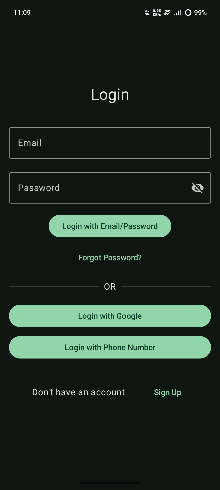
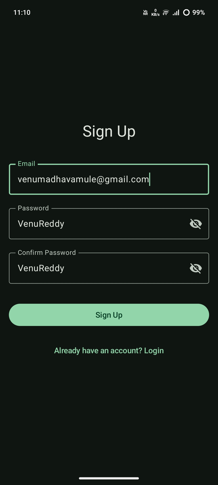
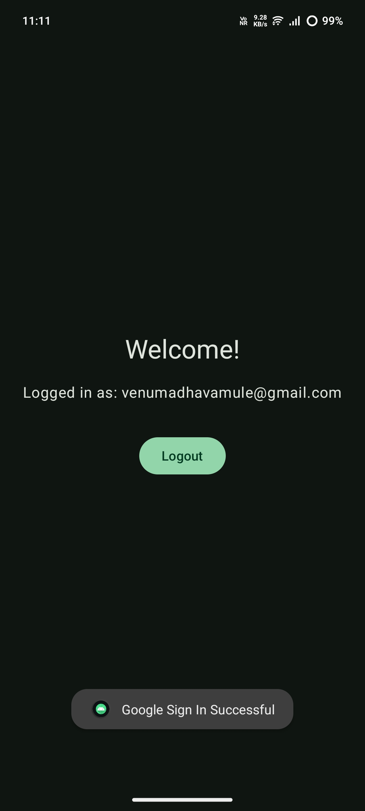

# 🔐 Login Buddy  

A simple and modern login application built with **Kotlin**, **Jetpack Compose**, and **Firebase Authentication**.  

---

## 📖 Description  
Login Buddy is a lightweight Android application that demonstrates how to implement a secure login system using **Firebase Authentication**.  
It is built entirely with **Kotlin** and **Jetpack Compose**, making it a great starter template for developers who want to quickly integrate authentication into their apps.  

This project focuses on simplicity, clean UI design, and ease of integration, serving as both a learning resource and a boilerplate for new projects.  

---

## 🚀 Features  
- 🔑 User authentication with **Firebase** (Email & Password)  
- 🖥️ Modern UI built with **Jetpack Compose**  
- ⚡ Lightweight, minimal, and beginner-friendly codebase  
- 📱 Ready-to-use boilerplate for integrating Firebase Auth in Android apps  

---

## 🛠️ Tech Stack  
- **Kotlin** – Android development language  
- **Jetpack Compose** – Modern UI toolkit  
- **Firebase Authentication** – Secure and easy-to-use auth service  

---

## 📂 Project Overview  
This app demonstrates how to:  
- Connect an Android app to Firebase  
- Handle user sign-in and sign-up with email & password  
- Manage authentication states (logged-in / logged-out)  

---

## 📸 Screenshots  

| Login Screen | Sign Up Screen | Home Screen |
|--------------|----------------|-------------|
|  |  |  |

---

## 🤝 Contribution  
Contributions are welcome! 🎉  
Feel free to fork this repo, open issues, or submit pull requests to improve the project.  

---
